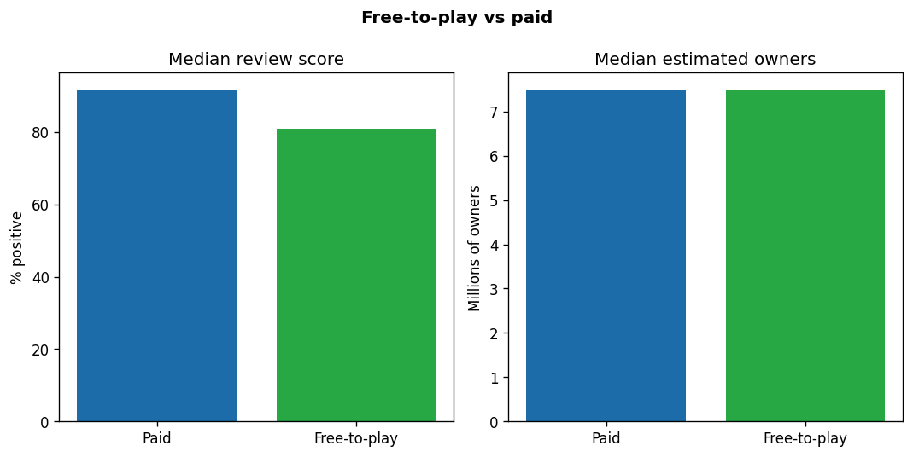
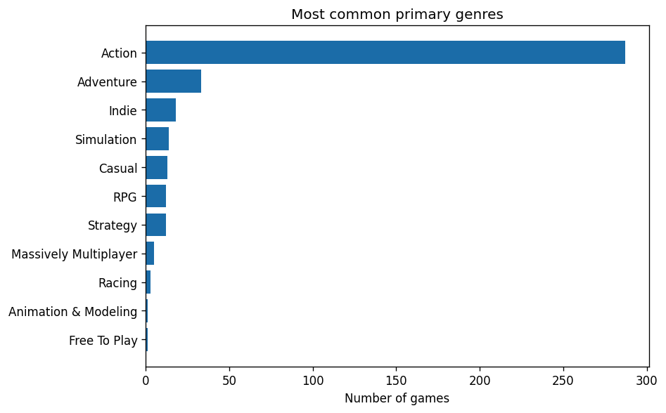
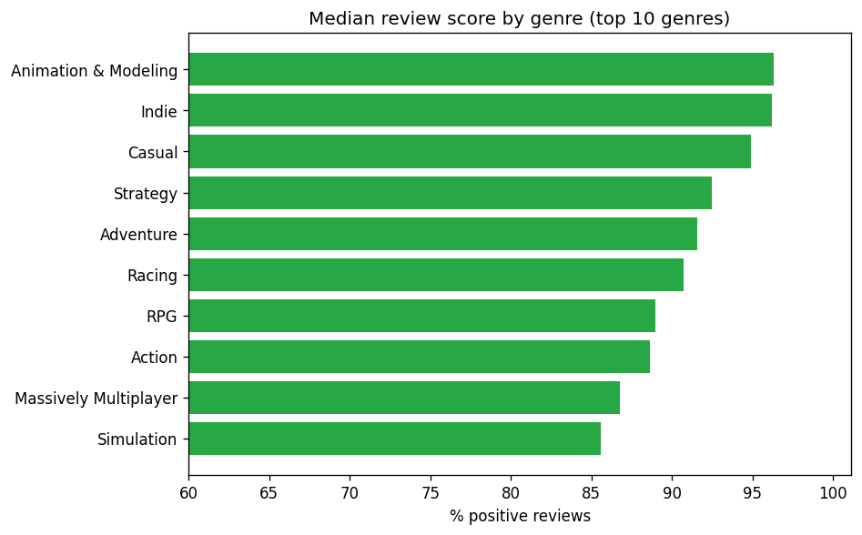
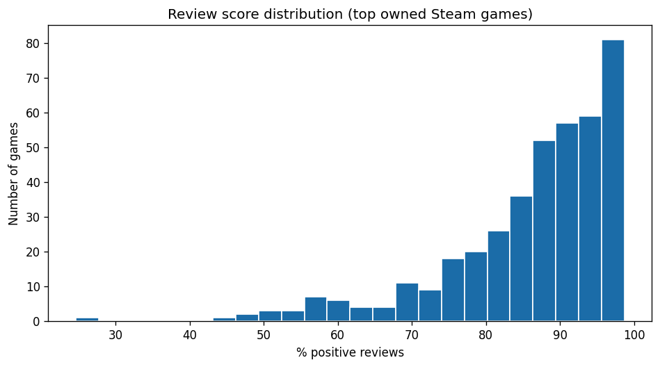
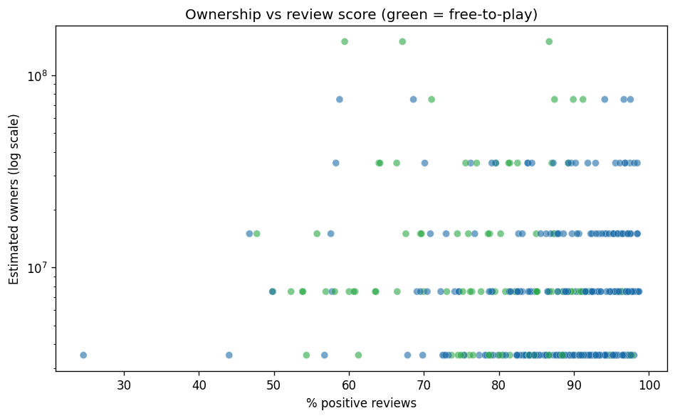

# 🎮 What Makes a Steam Game Succeed?

An end-to-end data project: pull live data from the [SteamSpy](https://steamspy.com) API,
clean and explore it in Python, and ship an interactive dashboard. The question — **what
separates a highly-rated, widely-played Steam game from the rest?**

**Stack:** Python · pandas · Plotly · Streamlit · matplotlib
**Sample:** the 400 most-owned games on Steam (enriched with genre + tags), pulled June 2026.

> **Run the dashboard in under a minute** — see [Quick start](#quick-start). The cleaned data
> is committed, so you can launch `streamlit run app.py` straight away.

---

## Key findings

### 1. Free-to-play wins reach. Paid wins ratings.
Free-to-play games are only **26%** of the most-owned list, yet they include the absolute
giants (CS:GO, Apex, PUBG). But when you look at *review quality*, paid games clearly win:

| Pricing | Median review score |
|---------|---------------------|
| Paid | **91.9%** positive |
| Free-to-play | **80.9%** positive |

Free games reach huge audiences, but their average reception is meaningfully lower — likely
the cost of monetization friction and a lower barrier to install-and-bounce.



### 2. The most *common* genre isn't the best-*rated* one.
**Action** accounts for **72%** of the most-owned titles (287 of 400) — it dominates the
catalog. But the highest *median* review scores belong to smaller genres:

- Most common: **Action (287)**, Adventure (33), Indie (18), Simulation (14), Casual (13)
- Highest rated: **Indie (96%)**, Casual (95%), Strategy (92%), Adventure (92%), RPG (89%)

Action is how you get *big*; Indie/Strategy is how you get *loved*.




### 3. A higher price tag doesn't buy a better game.
Across paid titles, price and review score are **weakly negatively correlated (-0.23)** —
if anything, pricier games rate slightly *lower*. Most top games cluster in the 80–95%
positive range regardless of cost.



### 4. Reach vs reception.
Plotting estimated ownership against review score shows the two success axes are largely
independent — you can be massively owned *and* divisive (battle-royale shooters), or modestly
owned *and* beloved (indies).



**Biggest developers by total estimated owners:** Valve (511M), PUBG Corporation (150M),
Respawn (150M), Capcom (87M), Rockstar North (82M).

---

## Quick start

```bash
# 1. install
pip install -r requirements.txt

# 2. (optional) refresh the data from SteamSpy
python fetch_data.py        # top ~1,000 most-owned games
python enrich_data.py 400   # add genre + tags for the top 400 (polite ~1 req/sec)

# 3. reproduce the charts + findings
python analysis.py

# 4. launch the interactive dashboard
streamlit run app.py
```

The dashboard lets you filter by genre, pricing, and review volume, and updates the KPIs
and charts live.

### Deploy it free
Push this repo to GitHub and deploy `app.py` on
[Streamlit Community Cloud](https://share.streamlit.io) — one click, no server needed.

---

## How it works

| File | Role |
|------|------|
| `fetch_data.py` | Pulls the 1,000 most-owned games from SteamSpy's bulk endpoint → `data/steam_games.csv` |
| `enrich_data.py` | Adds genre + top tags per title from SteamSpy's per-app endpoint → `data/steam_games_detailed.csv` |
| `analysis.py` | Cleans the data, computes the findings (`FINDINGS.txt`), exports charts to `charts/` |
| `app.py` | Streamlit dashboard over the cleaned data |
| `data/` | Cached CSV snapshots (committed for reproducibility) |
| `charts/` | Exported figures used above |

**Data cleaning highlights:** owner counts arrive as banded ranges (`"5,000,000 .. 10,000,000"`)
and are converted to midpoints; review score is computed as positive ÷ total reviews; price is
parsed from cents; genre is split to a primary label. Games with fewer than 50 reviews are
dropped so scores are meaningful.

---

## Limitations & next steps

- **Owner counts are banded** by SteamSpy, so owner medians are coarse — review scores are the
  more reliable signal, and the analysis leans on them.
- **Playtime** (`average_forever`) is no longer populated by the public API, so engagement-time
  analysis was dropped rather than reported as zeros.
- **Sample is the most-owned games**, which skews toward Action and big studios; an unbiased
  random sample would surface more of the long tail.
- **Next:** add release-year (Steam storefront API) for a trend-over-time view, and mine the
  review text for sentiment beyond the positive/negative split.

---

*Built by Phan Ha Tran Luong — [LinkedIn](https://linkedin.com/in/phan-ha-tran-luong) · [GitHub](https://github.com/KazooKat)*
